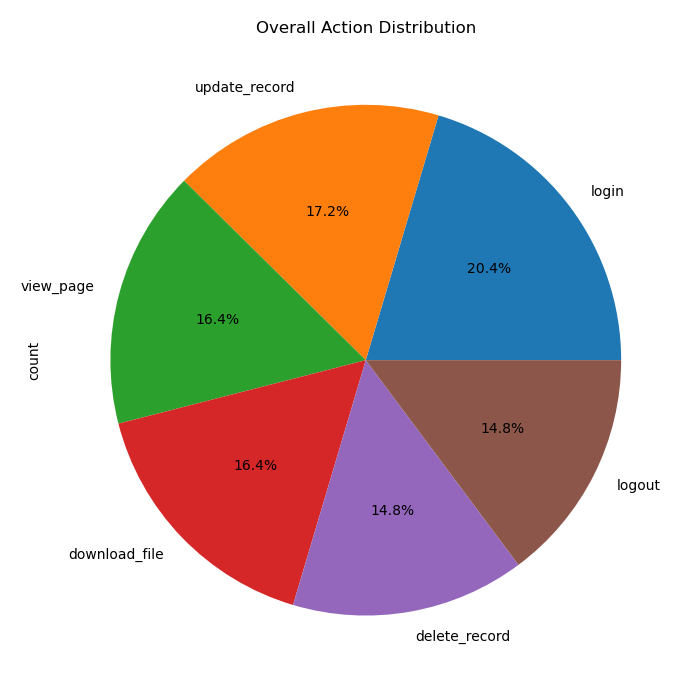
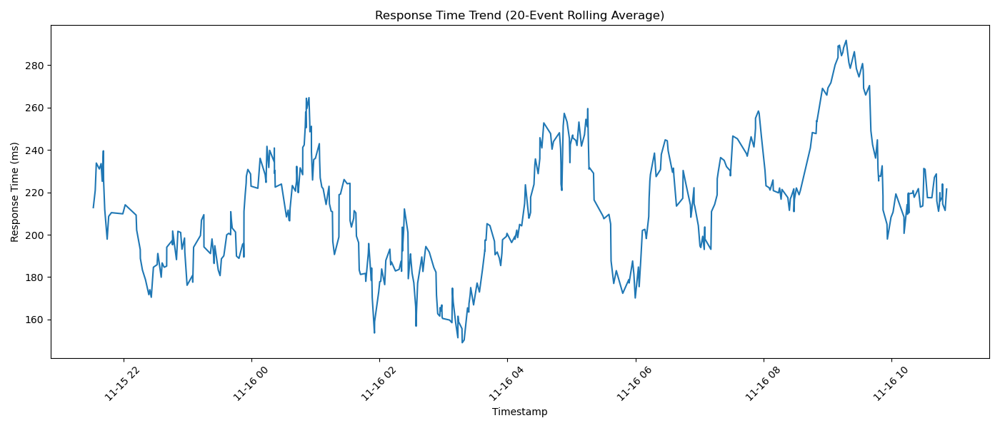

# Monitoring and Auditing Data Access in Big Data Environments

> A simulation-based log monitoring and anomaly detection framework that emulates enterprise-grade access auditing pipelines using Python, pandas, and Excel.

---

## Table of Contents

- [Project Overview](#project-overview)
- [Key Features](#key-features)
- [Repository Structure](#repository-structure)
- [Architecture](#architecture)
- [Dataset](#dataset)
- [Anomaly Detection Rules](#anomaly-detection-rules)
- [Visualizations](#visualizations)
- [Getting Started](#getting-started)
  - [Prerequisites](#prerequisites)
  - [Installation](#installation)
  - [Running the Project](#running-the-project)
- [Output](#output)
- [Findings Summary](#findings-summary)
- [Methodology](#methodology)
- [Future Improvements](#future-improvements)
- [Authors](#authors)

---

## Project Overview

This project simulates a small enterprise access-logging environment and demonstrates how raw user activity logs can be processed, visualized, and analyzed to detect suspicious or anomalous behavior. It was developed as part of the **DSA4030** course (Group 4) under the theme of *Monitoring and Auditing Data Access in Big Data Environments*.

The pipeline mirrors workflows found in real Security Operations Center (SOC) environments and Security Information and Event Management (SIEM) tools such as the **ELK Stack**, **Splunk**, and **Microsoft Sentinel** — but implemented in a lightweight, reproducible Python and Excel environment.

---

## Key Features

- **Simulated access log generation** — 500 structured events across 15 users, 6 action types, and multiple resources
- **Exploratory analysis via Jupyter Notebook** — interactive step-by-step analysis of access patterns
- **Rule-based anomaly detection** — Python script that detects five categories of suspicious behavior and writes structured alerts to a log file
- **Multi-tool dashboard** — Excel workbook combining charts and pivot summaries into a single operational view
- **Audit report** — formal written report documenting observations, methodology, and recommendations
- **Lightweight blueprint presentation** — slide deck outlining a log-auditing architecture for resource-constrained environments

---

## Repository Structure

```
Monitoring and Auditing Data Access (Big Data)/
│
├── access_logs (1).csv            # Simulated access log (500 events, 7 fields)
├── monitoring_setup.ipynb         # Jupyter Notebook: data loading, EDA, and visualizations
├── Anomaly_detection.py           # Rule-based anomaly detection engine → writes alerts.log
├── alerts.log                     # Generated output: all triggered alert messages
│
├── Dashboard.xlsx                 # Excel dashboard with embedded charts and pivot tables
├── Monitoring Setup.docx          # Technical write-up of monitoring methodology and findings
├── Monitoring Audit Report.docx   # Formal audit report with analysis and recommendations
├── DSA4030-Monitoring and         
│   auding data access-            
│   Methodology.docx               # Project methodology document (Group 4)
│
├── Lightweight Log Auditing       
│   Blueprint.pptx                 # Slide deck: log auditing blueprint for lean environments
│
├── action_distribution.png        # Chart: overall action distribution (pie chart)
└── response_time_rolling.png      # Chart: response time trend (20-event rolling average)
```

---

## Architecture

The pipeline follows a linear flow from raw simulation through visualization and review:

```
User Activity Simulation
        │
        ▼
  access_logs.csv          ← Central log file (7 fields per event)
        │
        ├──────────────────────────────────────┐
        ▼                                      ▼
monitoring_setup.ipynb               Anomaly_detection.py
(Visualization & EDA)                (Rule-based alerting)
        │                                      │
        ▼                                      ▼
 PNG Charts + Excel              alerts.log (structured alert output)
   Dashboard.xlsx
        │
        ▼
   Audit Report &
  Manual Review Layer
```

This architecture emulates the core stages of a SIEM pipeline: **ingest → normalize → analyze → alert → review**.

---

## Dataset

**File:** `access_logs (1).csv`

Each row represents a single user action. The log schema was standardized to balance simplicity with analytical richness:

| Field | Description |
|---|---|
| `timestamp` | ISO 8601 datetime of the event |
| `user_id` | Anonymized actor identifier (`user_1` … `user_15`) |
| `action` | Operation type: `login`, `logout`, `view_page`, `download_file`, `update_record`, `delete_record` |
| `resource` | Target resource: `dashboard`, `admin_panel`, `config.yaml`, `employee_db`, `public_page` |
| `status` | Outcome: `success` or `failed` |
| `ip_address` | Source IPv4 address (supports geo/suspicious-IP analysis) |
| `response_time_ms` | System response time in milliseconds (performance tracking) |

**Size:** 500 events | **Users:** 15 | **Time range:** November 2025

---

## Anomaly Detection Rules

**File:** `Anomaly_detection.py`

The script applies five sequential rules to every log row and writes any triggered alerts to `alerts.log`:

| Rule | Condition | Alert Type |
|---|---|---|
| **1. Brute-force detection** | User has > 10 failed login attempts | Potential credential stuffing / brute-force |
| **2. Off-hours access** | Activity during hours 0–4 or 21–23 | Suspicious time-of-day access |
| **3. High event volume** | User generates > 40 total events | Potential scripted or automated access |
| **4. Excessive deletes** | User performs > 5 `delete_record` actions | Data loss / insider threat risk |
| **5. High-risk action on sensitive resource** | `delete_record` or `update_record` on `admin_panel` or `config.yaml` | Privileged resource tampering |
| **6. New IP address** | First time a user accesses from a given IP | Identity verification needed |

All alerts follow the format:
```
ALERT: <description> (Action: <action>, Resource: <resource>, Status: <status>, IP: <ip>)
```

---

## Visualizations

The following charts were produced in `monitoring_setup.ipynb` and embedded in `Dashboard.xlsx`:

| Chart | Description |
|---|---|
| **Events per User** | Bar chart of total event count per user. Highlights unusually active accounts (e.g. `user_5` with 41+ events). |
| **Actions per Hour of the Day** | Line chart of activity volume by hour (0–23). Reveals usage peaks and off-hours anomalies. |
| **Failed Login Attempts per User** | Bar chart of failed-status events per user. Used to identify brute-force candidates. |
| **Overall Action Distribution** | Pie chart of global action type shares (login ~20%, update_record ~17%, delete_record ~15%). |
| **Actions per User (Stacked Bar)** | Per-user breakdown of action types, revealing behavioral profiles across the user population. |
| **Response Time Trend** | Rolling 20-event average of `response_time_ms`. Surfaces performance degradation and outlier spikes. |

Preview:

| Action Distribution | Response Time Trend |
|---|---|
|  |  |

---

## Getting Started

### Prerequisites

- Python 3.8+
- pip

### Installation

Clone the repository and install the required packages:

```bash
git clone https://github.com/<your-org>/monitoring-auditing-data-access.git
cd monitoring-auditing-data-access
pip install pandas matplotlib openpyxl
```

### Running the Project

**1. Exploratory analysis (Jupyter Notebook)**

```bash
jupyter notebook monitoring_setup.ipynb
```

Run all cells in order to generate all charts and review the step-by-step analysis.

**2. Anomaly detection**

```bash
python Anomaly_detection.py
```

This reads `access_logs (1).csv`, applies all detection rules, prints alerts to the console, and writes them to `alerts.log`.

**3. Dashboard**

Open `Dashboard.xlsx` in Microsoft Excel or LibreOffice Calc to view the pre-built operational dashboard.

---

## Output

After running `Anomaly_detection.py`, the `alerts.log` file will contain structured alerts such as:

```
ALERT: High failed logins (12) for user user_3 - potential brute-force. (Action: login, Resource: admin_panel, Status: failed, IP: 192.168.1.42)
ALERT: Suspicious hour (2:00) activity for user user_7 at 2025-11-17 02:14:33. (Action: download_file, Resource: employee_db, Status: success, IP: 71.47.248.197)
ALERT: High-risk action 'delete_record' on sensitive resource 'admin_panel' by user user_2 at 2025-11-18 14:02:11. (Action: delete_record, Resource: admin_panel, Status: success, IP: 43.21.76.166)
```

---

## Findings Summary

Key observations from the analysis of the 500-event log:

- **`user_5`, `user_7`, and `user_14`** are the highest-activity users, with event counts around 38–41. While potentially normal for power users, these warrant additional scrutiny.
- **`delete_record` accounts for ~15% of all actions** — unusually high for a destructive operation. Delete permissions appear too broadly assigned across the user population.
- **Off-hours activity is widespread**, with multiple users accessing the system between 21:00–23:00. Access during hours 0–4 is rare but present.
- **New-IP alerts are the most frequent alert type**, suggesting users access the system from varied locations or devices. This could indicate legitimate remote work or session hijacking.
- **Response times are generally stable** but show isolated spikes that could indicate resource contention or targeted load.
- **`user_10`** has the lowest activity (~25 events), potentially representing an idle or orphaned account that should be reviewed or deprovisioned.

Full analysis is available in `Monitoring Audit Report.docx` and `Monitoring Setup.docx`.

---

## Methodology

The project methodology follows a five-stage pipeline:

1. **Log schema design** — Define fields that balance analytical value with storage simplicity, consistent with SIEM schemas (ELK, Splunk, cloud-native).
2. **Simulation** — Generate 500 realistic events distributed across 15 users, 6 action types, and multiple resources with realistic timestamps and IP variation.
3. **Monitoring & EDA** — Use `pandas` and `matplotlib` to produce behavioral summaries and time-series visualizations in a Jupyter Notebook.
4. **Anomaly detection** — Implement five deterministic rules targeting brute-force attempts, off-hours access, high event volume, data destruction risk, and identity anomalies.
5. **Reporting & review** — Compile findings into a formal audit report and a lightweight auditing blueprint for operational teams.

For full methodology details, see `DSA4030-Monitoring and auding data access-Methodology.docx`.

---

## Future Improvements

- [ ] Replace rule-based detection with a statistical or ML-based approach (e.g. Isolation Forest, LSTM on time-series)
- [ ] Add geolocation enrichment to flag logins from unexpected countries
- [ ] Integrate with a live log source (e.g. syslog, AWS CloudTrail) instead of a static CSV
- [ ] Build a real-time alerting pipeline using Kafka + Elasticsearch
- [ ] Add alert deduplication and severity scoring to reduce noise
- [ ] Implement a Kibana or Grafana dashboard for live visualization

---

## Authors

**Group 4 — DSA4030**

---

*This project is academic in nature and uses entirely simulated data. No real user data was collected or used.*
